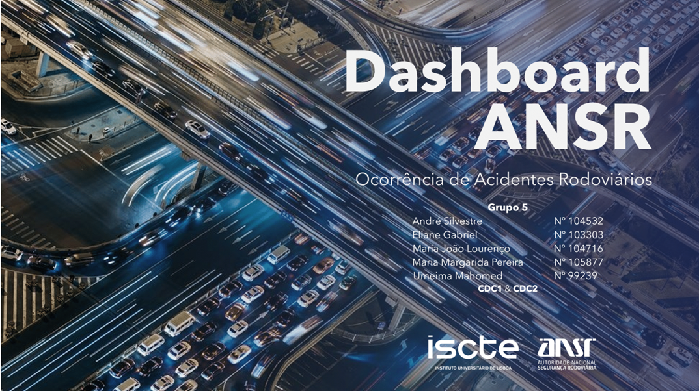
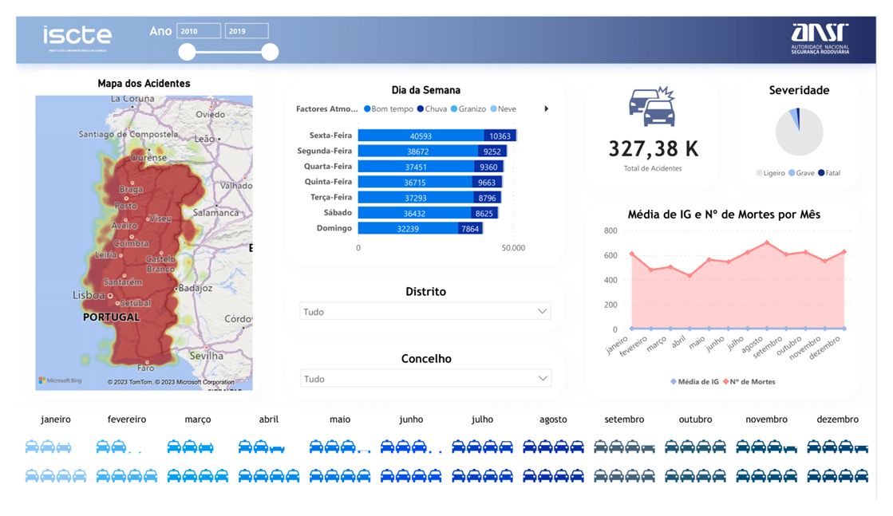
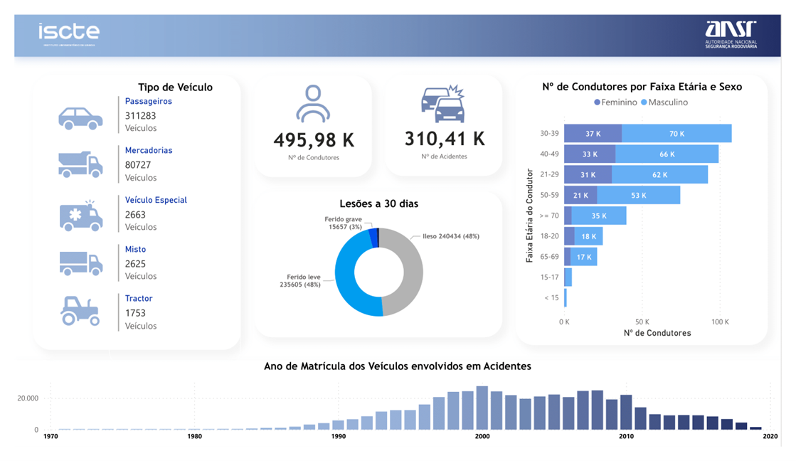

# 🚗 ANSR Road Safety Analysis: Clustering & Time Series Forecasting 📈

   

    <!-- Project Links -->
    

## 📝 Description

This project provides a deep-dive analysis into road safety in Portugal, using a comprehensive dataset of traffic accidents from 2010 to 2019 provided by the **ANSR (Autoridade Nacional de Segurança Rodoviária)**. The study is twofold: first, it uses geospatial clustering to identify strategic locations for speed camera installation in Lisbon; second, it employs time series forecasting to analyze and predict national accident trends, aiming to inform public awareness campaigns.

## ✨ Objectives

The project aims to deliver actionable insights for road safety improvement through two primary objectives:

1.  **Radar Placement Optimization:**
    *   Verify the influence of existing speed cameras on accident reduction in Lisbon.
    *   Use clustering algorithms to recommend strategic locations for new speed cameras.

2.  **Temporal Trend Analysis:**
    *   Analyze monthly accident data to identify critical periods and temporal patterns.
    *   Develop a predictive model to forecast future accident occurrences and support the timing of awareness campaigns.

    

## 🎓 Project Context

This group project was developed for the **Projeto Aplicado para Ciência de Dados II** (*Applied Project in Data Science II*) course, as part of the 3rd year of the **[Licenciatura em Ciência de Dados](https://www.iscte-iul.pt/degree/code/0322/bachelor-degree-in-data-science)** (*Bachelor Degree in Data Science*) at **ISCTE-IUL**, during the 2023/2024 academic year.

## 🗺️ Data Sources

*   **ANSR:** The primary data source, containing detailed records of road accidents in Portugal from 2010 to 2019.
    *   **Note:** The dataset provided by ANSR cannot be shared publicly due to privacy and data protection regulations.
*   **Radares de Portugal:** A supplementary dataset providing geospatial information on existing speed cameras.
    *   **Note:** This dataset is publicly available and can be accessed [here](https://www.radaresdeportugal.com/).

## 🛠️ Technologies & Libraries

The project was implemented in **Python**, leveraging a powerful stack of libraries for data science and visualization.

    
    
    
    
    

**Machine Learning & Time Series:**

    
    

**Geospatial & Visualization:**

    
    
    

---

## ⚙️ Project Workflow (CRISP-DM)

The project was executed following the CRISP-DM methodology, tailored for each of the two main objectives.

### Objective 1: Radar Placement Analysis (Lisbon)
1.  **Data Preparation:** Merged ANSR accident data with radar locations. Cleaned and standardized GPS coordinates, and imputed missing values using **K-Nearest Neighbors (KNN)** to ensure data completeness.

2.  **Exploratory Data Analysis (EDA):** Analyzed the influence of existing radars, confirming a positive correlation with accident reduction. The analysis was focused on high-severity accidents in Lisbon.

3.  **Clustering:** Applied unsupervised learning to identify accident hotspots.
    *   **Algorithms Tested:** K-Means, OPTICS, and **DBSCAN**.
    *   **Selected Algorithm:** **DBSCAN** was chosen for its ability to identify density-based clusters of arbitrary shapes, making it ideal for geospatial data. Key parameters (`eps` = 500m, `min_samples` = 4) were tuned to find meaningful accident clusters.
    *   **Results:** Identified **16 distinct accident clusters**, with the A5 and EN6 highways showing significant concentrations.

4.  **Deployment:** Created interactive maps using **Folium**, allowing for the visualization of accident locations, radar positions, and the identified clusters. **Google Street View** was used to assess the practical viability of recommended installation sites.

### Objective 2: Temporal Trend Analysis (Portugal)
1.  **Data Preparation:** Aggregated accident data by month to create a time series dataset from 2010 to 2019.
2.  **Time Series Analysis:**
    *   **Decomposition:** Analyzed the series to identify trend, seasonality (annual), and residual components.
    *   **Stationarity Tests:** Used **KPSS** and **Augmented Dickey-Fuller** tests to confirm the series was non-stationary.
    *   **ACF/PACF Analysis:** Plotted Autocorrelation and Partial Autocorrelation functions to determine the parameters for the SARIMA model.
3.  **Modeling & Forecasting:**
    *   **SARIMA Model:** Utilized `pmdarima`'s `auto_arima` function to automatically select the optimal **SARIMA(4,0,0)(0,1,1)[12]** model.
    *   **Forecasting:** The model was trained on data from 2010-2017 and tested on 2018-2019 data. It demonstrated acceptable predictive capability and was used to forecast accident counts for 2020.
4.  **Deployment:**
    *   **Awareness Campaign:** Based on the finding that October is a consistently critical month for accidents, a sample awareness campaign, **"Por via das dúvidas, abrande: outubro crítico"**, was designed using **Canva**.
    *   **Interactive Dashboard:** A comprehensive **Power BI Dashboard** was created to allow for dynamic exploration of all datasets and findings.

## 📊 Deployment & Key Visualizations

The project resulted in several deployed artifacts for analysis and communication.

### **Power BI Dashboard** 

An interactive dashboard for exploring accident data by location, time, and severity.

  
  
  

### **Folium Map of Accident Clusters**

An interactive map visualizing accident hotspots in Lisbon, with radar locations and cluster boundaries.

  

### **October Awareness Campaign Concept**

A sample campaign proposal designed to raise awareness about road safety during critical months, particularly October.

  
    
    

 

## 👥 Team Members (Group 5)

*   **André Silvestre** (Nº104532)
*   **Eliane Gabriel** (Nº103303)
*   **Maria João Lourenço** (Nº104716)
*   **Maria Margarida Pereira** (N°105877)
*   **Umeima Adam Mahomed** (Nº99239)

## 🇵🇹 Note

This project was developed using Portuguese from Portugal 🇵🇹.